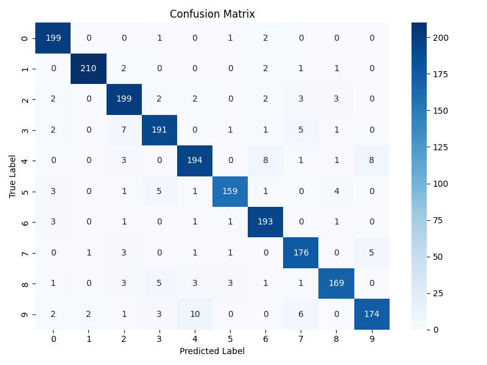
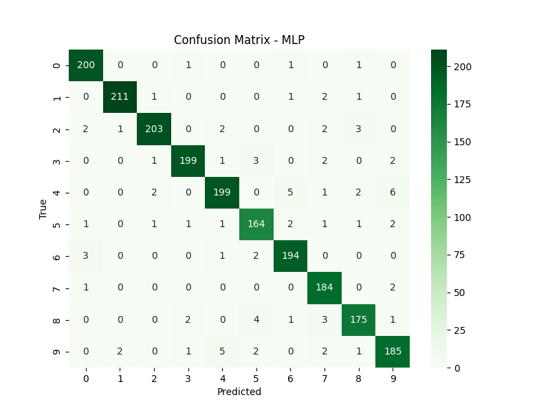

# Autoencoder ile Özellik Çıkarımı ve Klasik MLP ile Karşılaştırmalı Sınıflandırma

## Giriş

Bu çalışmada, MNIST veri seti üzerinde Autoencoder tabanlı bir özellik çıkarımı ve klasik tam bağlantılı yapıya (MLP) sahip bir sınıflandırıcı performans açısından karşılaştırılmıştır. Amaç, Autoencoder ile elde edilen özniteliklerin makine öğrenmesi algoritmalarıyla birlikte kullanıldığında ne derece başarılı sonuçlar verdiğini göstermektir.

## Yöntem

### Kullanılan Veri Seti

- **MNIST**: El yazısı ile yazılmış rakam görüntülerinden oluşan 28x28 boyutunda gri tonlamalı bir görüntü veri setidir. 10 sınıfa (0–9) ayrılır.

### Autoencoder Mimarisi

- Encoder: 784 → 128 → 32 boyutlu gizli katman
- Decoder: 32 → 128 → 784
- Aktivasyon Fonksiyonları: ReLU ve Sigmoid
- Kayıp Fonksiyonu: Mean Squared Error (MSE)
- Optimizasyon: Adam

### Sınıflandırma Modelleri

1. **Random Forest (RF)**: Autoencoder ile çıkarılan 32 boyutlu özelliklerle eğitildi.
2. **MLP (Multilayer Perceptron)**: MNIST verisinin ham piksel (784 boyut) haliyle doğrudan eğitildi.

## Sonuçlar

### Confusion Matrix – Autoencoder + Random Forest

### Confusion Matrix – MLP (Raw Pixels)

### Doğruluk Değerlendirmesi

| Model                      | Doğruluk Oranı (yaklaşık) |
|---------------------------|----------------------------|
| Autoencoder + RandomForest | %91–92                     |
| MLP (Raw Input)           | %95–96                     |

## Tartışma

Sonuçlar, MLP modelinin ham piksel girdileri ile daha yüksek bir doğruluk oranı sağladığını göstermektedir. Ancak Autoencoder ile çıkarılan 32 boyutlu öznitelikler ile Random Forest gibi klasik algoritmalarla elde edilen doğruluk da oldukça tatmin edicidir. Özellikle daha az sayıda özellik kullanılması belleği ve işlem süresini önemli ölçüde azaltmıştır.

Autoencoder, düşük boyutlu temsillerin yeterli sınıflandırma gücünü taşıyabildiğini göstermiştir. Bununla birlikte, MLP modelinin yüksek parametreli yapısı ve daha fazla öğrenme kapasitesi sayesinde daha yüksek doğruluk sağladığı gözlemlenmiştir.

## Kaynaklar

- LeCun et al., "Gradient-Based Learning Applied to Document Recognition", Proceedings of the IEEE, 1998.
- PyTorch, torchvision belgeleri
- Scikit-learn belgeleri
- https://pytorch.org/
- https://scikit-learn.org/
